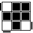
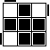

魔方的入门教程很多, 我跟着魔方小站站长学习入门的. 基本学完, 2分钟之内可以完成
具体可参考网站[http://www.rubik.com.cn](http://www.rubik.com.cn)
然后勤加练习, 很快能到达1分钟水平.

下面总结下, 可以在学习过程中, 顺便记忆的公式

**CROSS**
N/A

**F2L** (层先法)

| 图片 | 操作 | 
| --- | --- |
|  | (R U R’) |
|  | y’ (R’ U’ R) 或 F’ U’ F |
|  | U (R U’ R’) U’ (F’ U F) |
|  | U’ (F’ U F) U (R U’ R’) |

 **OLL**

| 图片 | 操作 | 
| --- | --- |
|  | F (R U R’ U’) F’ |
|  | R U’ U’ R’ U’ R U’ R’ |
|  | R’ U2 R U R’ U R |

**PLL**

| 图片 | 操作 | 
| --- | --- |
|  | x’ R2 D2 (R’ U’ R) D2 (R’ U R’) x |
|  | (R U’ R) U (R U R U’) (R’ U’ R2) |