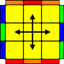

1分钟到50秒, 需要多背几个OLL和PLL公式

**OLL** 
十字相关的7个公式, 除了入门阶段的2个, 还有5个

| 图片 | 操作 |
| --- | --- |
|  | (r U R’ U’) (r’ F R F’) |
|  | F’ (r U R’ U’) (r’ F R) |
|  | (R2 D’)(R U’ U’)(R’ D)(R U’ U’ R) |
|  | (R U U R’ U’) (R U R’ U’) (R U’ R’) |
|  | R U’ U’(R2’ U’) (R2 U’) R2’ U2 R |

**PLL**
和边相关的4个公式, 初了入门阶段的1个, 还有3个

| 图片 | 操作 |
| --- | --- |
|  | (R2’ U) (R U R’ U’)(R’ U’) (R’ U R’) |
|  | M2 U M2 U2 M2 U M2 |
|  | (M2 U M2 U) (M U2)(M2 U2) (M U2) |