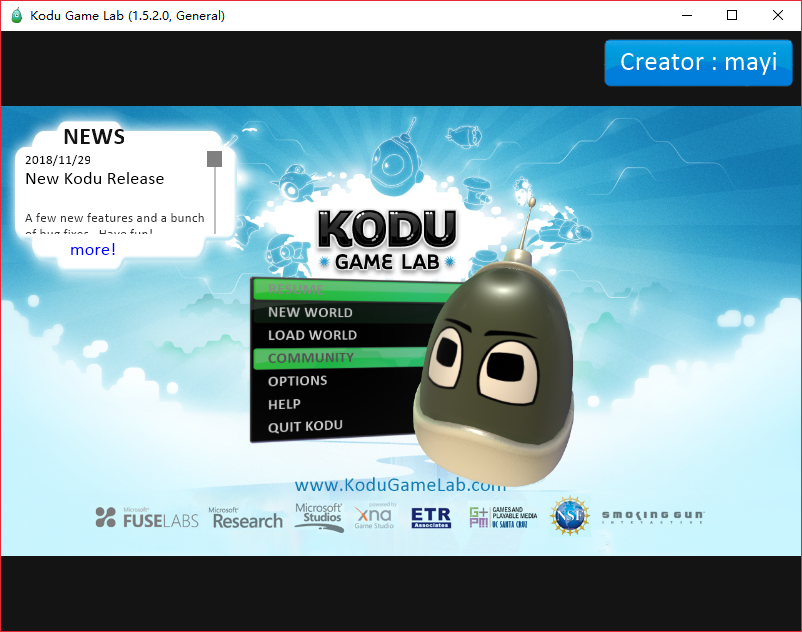

Kodu(酷豆) 是微软公司开发的儿童编程软件，类似于Scratch， 鼠标点击即可编程，无需编写代码。  

儿童或成年人都可使用，支持电脑和Xbox，不管有没有专业的设计和编程能力，使用Kudo，即可创建简单的3D游戏。

Kodu让孩子在制作游戏的同时，可以学习编程、培养创造力和解决问题的能力。

官方网站: [https://www.kodugamelab.com/](https://www.kodugamelab.com/)

