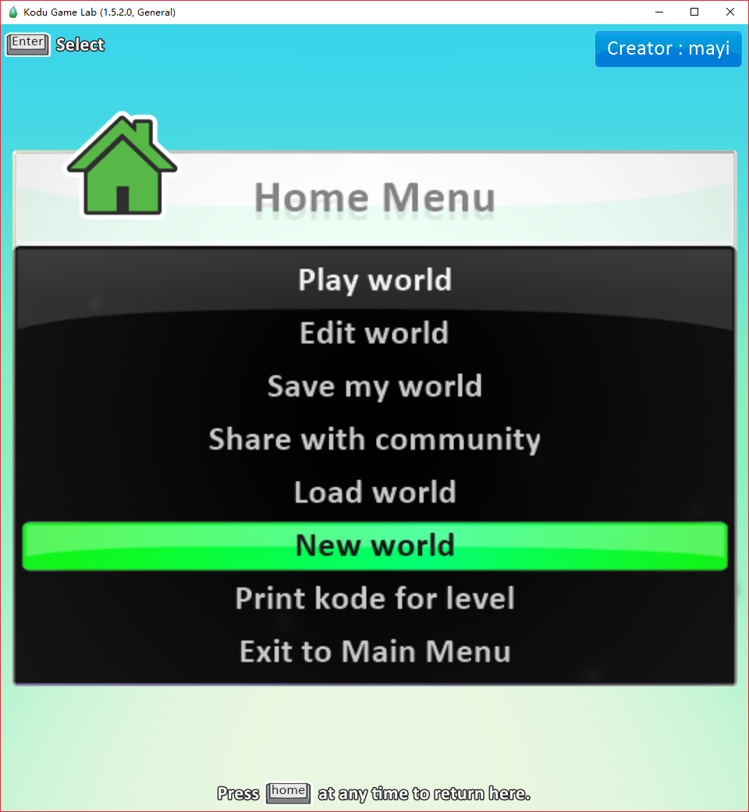
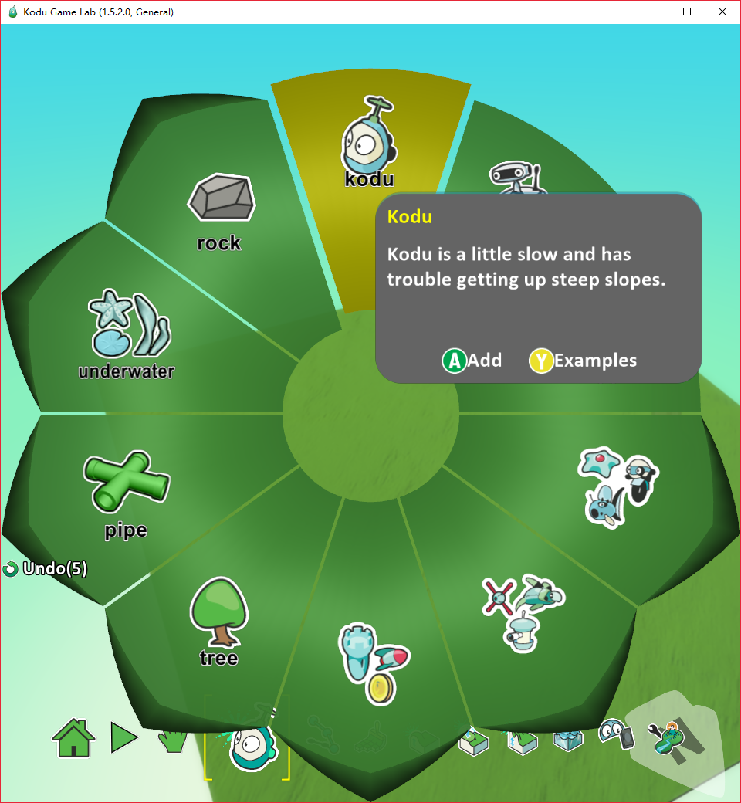
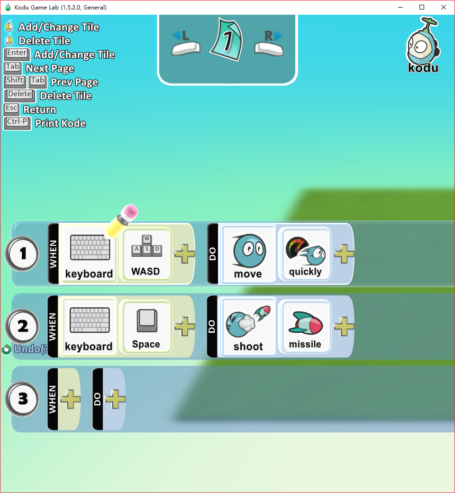

创建我们的第一个游戏角色, 通过WASD控制移动, 空格键发射炮弹.

通过如下3步完成, 

1. 我们首先创建第一个游戏, 点击"New world".

2. 点击工具栏中, 选择菜单中kodu, 添加对象.

3. 对kodu右键, 对kodu进行如下编程.
- keyboard 选项WASD: 当用户按WASD键的时候.
- move 动作: 对象运动, quickly表示快速.
- keyboard 选择Space: 当用户按空格键的时候
- shoot 动作: 发射, missile表示炮弹.

自此, 我们拥有了一个Kudo对象, 运行起来后, 就可以控制了. 孩子应该是很容易快速入门的.
