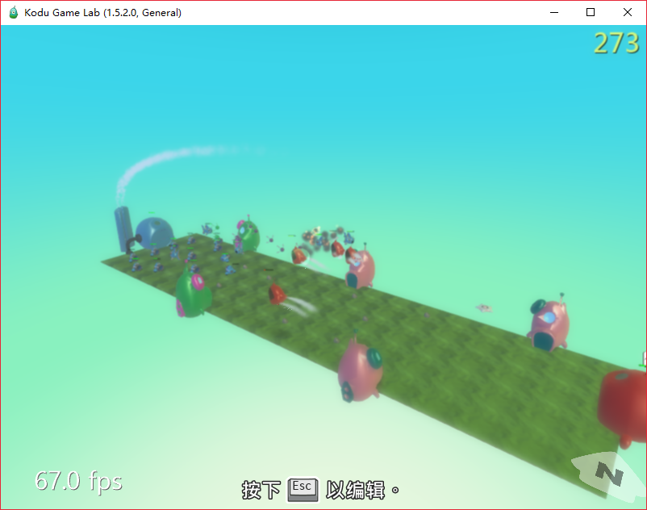
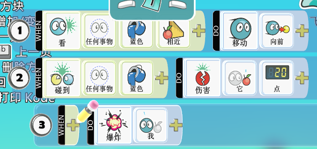
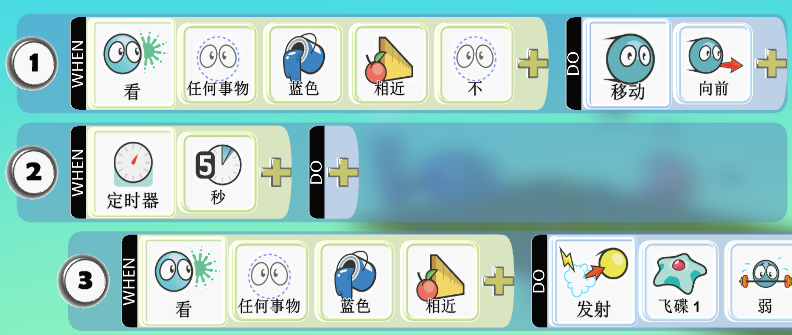
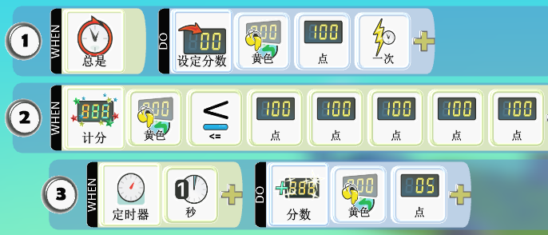
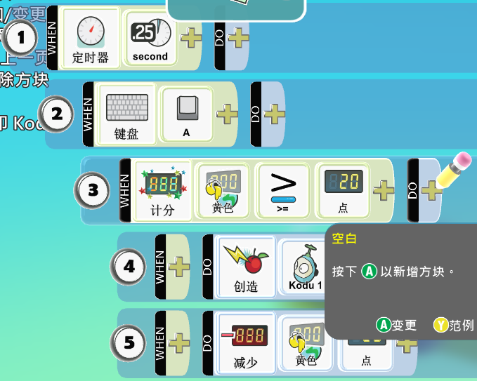
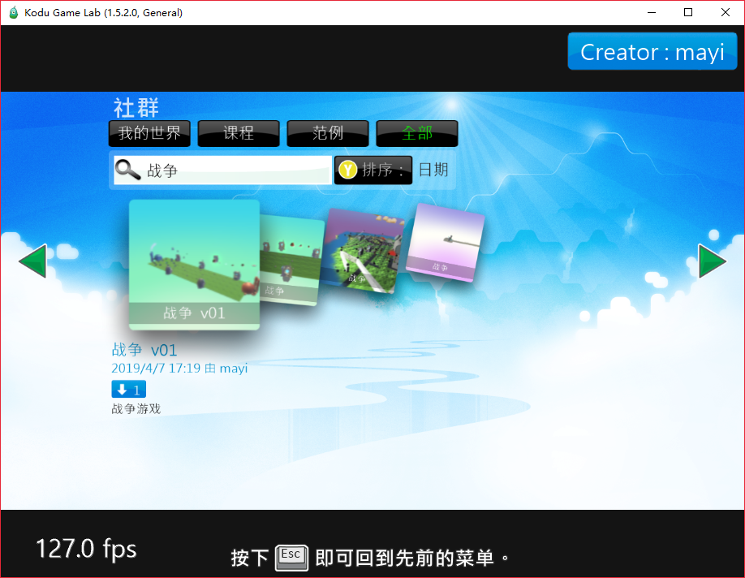

花了几个小时, 开发了第一个策略战争游戏
通过ASDF按键操作, 创建各个精灵进行战斗.

## 几个小技巧
### 子弹自定义问题
Kodu中的导弹有2个问题,  一会有误伤自己, 二会敌对导弹互相撞不能抵消.
为解决这几个自定义的问题, 使用"卫星"和"飞碟"代替导弹, 自定义行为

### 发射子弹
由于是自定义的子弹, 需要改用"发射"

### 金币随时间增加

### 基本操作
定义A按键, 进行创建精灵的动作, 并减少必须的金币

## 范例
最后, 范例有上传到社区, 如有需要, 请搜索"战争", 下载查看.

