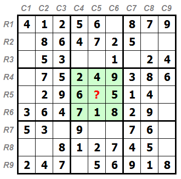
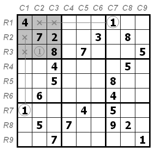
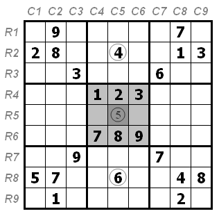
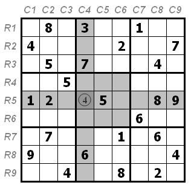

今天又被小学生的题目难道了, 重新系统学习一下数独. 不过貌似下面的入门技巧还不能完全解决这个小学生题目. 后续继续学习进阶, 高级篇.

## 唯一数
直接利用数独规则即可(同一排, 同一行, 同一宫只能包含数字一次), 如下图,

## 宫/行列摒除
排除数字A不可能的位置, 如只剩余一个位置了, 那这个位置就是数字A, 如下图,

## 唯一余数
和唯一数相似, 但更难观察, 主要技巧还是有限观察数据多的行/列/宫的剩余格.
如下图, 特别观察4和6的位置, 它排除位置(R5C5)有4和6的可能性.

另一图, 请参考标灰的位置

参考 [http://www.sudokufans.org.cn/forums/topic/69/](http://www.sudokufans.org.cn/forums/topic/69/)