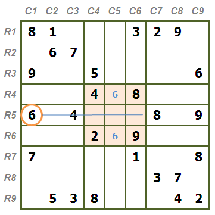
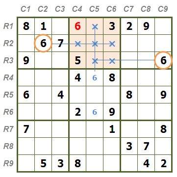
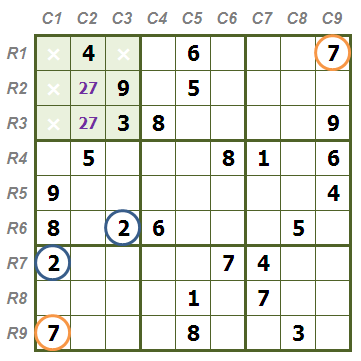
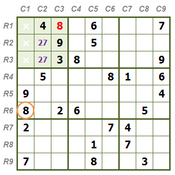
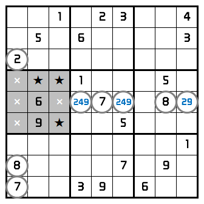
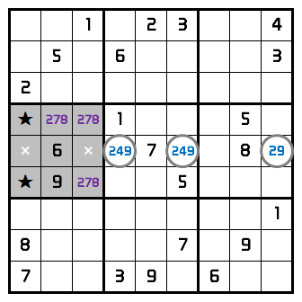
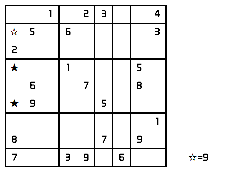

学完三链数法, 终于把那道小学题目推导出来了. 

## 区块摒除法
如下图, 推测6可能的位置在R4C5或者R6C5, 不管如何, 都已经证明6在C5.

然后, 利用宫/行/列摒除法

## 数对法
如下图, 数字2与7同时对第一宫摒除，得到这两个数字均只可能在R2C2与R3C2这两个位置，我们称R2C2与R2C3是27数对

数字8对第一宫摒除，得到摒余解R1C3=8.

## 三链数
和上面的数对法相似, 只是拓展到3个数和3格. 这三格需属于同行或同列或同宫.
观察是一个问题, 可能真需要完全把单元标识出来后才可以完成. 
如下图, 通过宫/行/列摒除法, 可以判断第五行的几个位置的数字分别依次为249,249,29，，则第五行的其他格不能再有2, 4, 9.

于是, 推理出278的可能性

可断定黑星的部分必然有4, 最后得到白星为9

参考 [http://www.sudokufans.org.cn/forums/topic/69/](http://www.sudokufans.org.cn/forums/topic/69/)