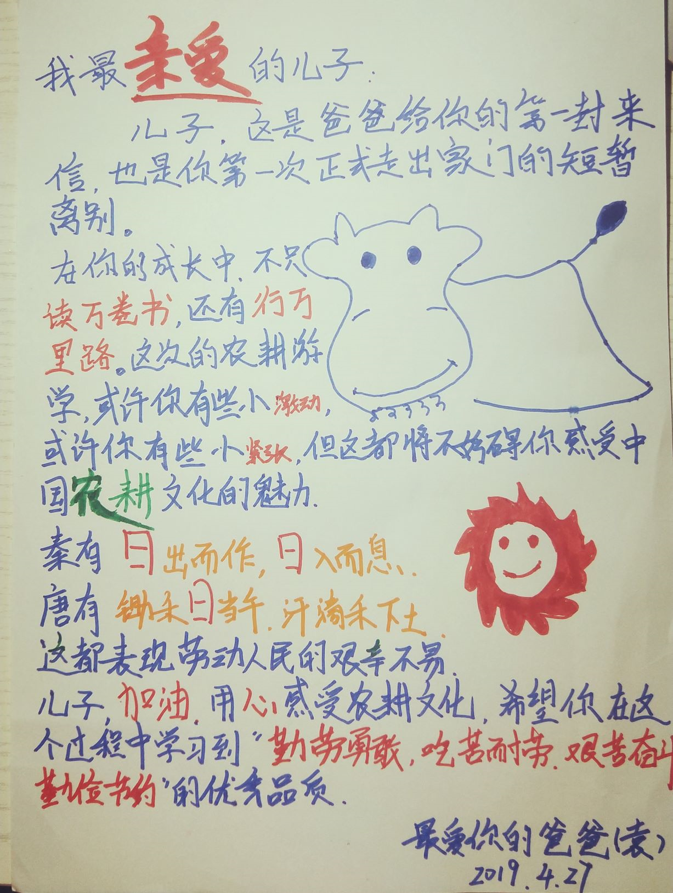

华德福教育鼓励接触自然. 明天就是三年级的儿子第一次的游学, 老师要求写信给予他们鼓励.

鼓励农耕游学
=======================
我最亲爱的儿子:

儿子, 这是爸爸给你的第一封来信, 也是你第一次正式走出家门的短暂离别.  
在你的成长中, 不只读万卷书，还有行万里路. 这次的农耕**游学**,  或许你还有些小激动, 或许你有些小紧张, 但这都将不妨碍你感受中国**农耕**文化的魅力. 
秦有"日出而作, 日入而息, 凿井而饮, 耕田而食", 唐有"锄禾日当午, 汗滴禾下土, 谁知盘中餐, 粒粒皆辛苦". 这都表现劳动人民的艰辛不易.
儿子, 加油! 用心感受农耕文化, 希望你在这个过程中学习"勤劳勇敢, 吃苦耐劳, 艰苦奋斗, 勤俭节约"的优秀品质.
加油, 加油, 加油!!!

最爱你的爸爸

手写的信
================
