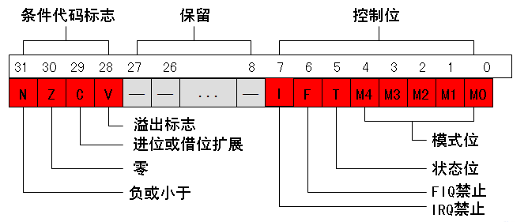

ARM处理器共有7种不同的处理器模式
===

1. 用户模式(User): 正常程序的执行模式。
2. 快速中断模式(FIQ): 用于高速数据传输和通道处理。
3. 外部中断模式(IRQ): 用于通常的外部中断处理。
4. 特权模式(SVE): 又叫管理模式，供操作系统使用的一种保护模式。
5. 数据访问中止模式(ABT): 用于虚拟存储和存储保护。
6. 未定义指令中止模式(UND): 用于支持通过软件方针硬件的协处理器。
7. 系统模式(SYS): 用于运行特权级的操作系统任务。

各种处理器模式下的寄存器
===

\<table border="1" style="text-align: left;-en-clipboard:true;"\>\<colgroup\>\<col\>\<col\>\<col\>\<col\>\<col\>\<col\>\<col\>\</colgroup\>\<tbody\>\<tr\>\<td valign="top" width="59"\>\
用户\</div\>\</td\>\<td valign="top" width="78"\>\
系统\</div\>\</td\>\<td valign="top" width="80"\>\
特权\</div\>\</td\>\<td valign="top" width="80"\>\
中止\</div\>\</td\>\<td valign="top" width="80"\>\
未定义指令\</div\>\</td\>\<td valign="top" width="80"\>\
外部中断\</div\>\</td\>\<td valign="top" width="80"\>\
快速中断\</div\>\</td\>\</tr\>\<tr\>\<td valign="top" width="59"\>\
R0\</div\>\</td\>\<td valign="top" width="78"\>\
R0\</div\>\</td\>\<td valign="top" width="80"\>\
R0\</div\>\</td\>\<td valign="top" width="80"\>\
R0\</div\>\</td\>\<td valign="top" width="80"\>\
R0\</div\>\</td\>\<td valign="top" width="80"\>\
R0\</div\>\</td\>\<td valign="top" width="80"\>\
R0\</div\>\</td\>\</tr\>\<tr\>\<td valign="top" width="59"\>\
R1\</div\>\</td\>\<td valign="top" width="78"\>\
R1\</div\>\</td\>\<td valign="top" width="80"\>\
R1 &nbsp; &nbsp; &nbsp; &nbsp;\</div\>\</td\>\<td valign="top" width="80"\>\
R1\</div\>\</td\>\<td valign="top" width="80"\>\
R1\</div\>\</td\>\<td valign="top" width="80"\>\
R1\</div\>\</td\>\<td valign="top" width="80"\>\
R1\</div\>\</td\>\</tr\>\<tr\>\<td valign="top" width="59"\>\
R2\</div\>\</td\>\<td valign="top" width="78"\>\
R2\</div\>\</td\>\<td valign="top" width="80"\>\
R2\</div\>\</td\>\<td valign="top" width="80"\>\
R2\</div\>\</td\>\<td valign="top" width="80"\>\
R2\</div\>\</td\>\<td valign="top" width="80"\>\
R2\</div\>\</td\>\<td valign="top" width="80"\>\
R2\</div\>\</td\>\</tr\>\<tr\>\<td valign="top" width="59"\>\
R3\</div\>\</td\>\<td valign="top" width="78"\>\
R3\</div\>\</td\>\<td valign="top" width="80"\>\
R3\</div\>\</td\>\<td valign="top" width="80"\>\
R3\</div\>\</td\>\<td valign="top" width="80"\>\
R3\</div\>\</td\>\<td valign="top" width="80"\>\
R3\</div\>\</td\>\<td valign="top" width="80"\>\
R3\</div\>\</td\>\</tr\>\<tr\>\<td valign="top" width="59"\>\
R4\</div\>\</td\>\<td valign="top" width="78"\>\
R4\</div\>\</td\>\<td valign="top" width="80"\>\
R4\</div\>\</td\>\<td valign="top" width="80"\>\
R4\</div\>\</td\>\<td valign="top" width="80"\>\
R4\</div\>\</td\>\<td valign="top" width="80"\>\
R4\</div\>\</td\>\<td valign="top" width="80"\>\
R4\</div\>\</td\>\</tr\>\<tr\>\<td valign="top" width="59"\>\
R5\</div\>\</td\>\<td valign="top" width="78"\>\
R5\</div\>\</td\>\<td valign="top" width="80"\>\
R5\</div\>\</td\>\<td valign="top" width="80"\>\
R5\</div\>\</td\>\<td valign="top" width="80"\>\
R5\</div\>\</td\>\<td valign="top" width="80"\>\
R5\</div\>\</td\>\<td valign="top" width="80"\>\
R5\</div\>\</td\>\</tr\>\<tr\>\<td valign="top" width="59"\>\
R6\</div\>\</td\>\<td valign="top" width="78"\>\
R6\</div\>\</td\>\<td valign="top" width="80"\>\
R6\</div\>\</td\>\<td valign="top" width="80"\>\
R6\</div\>\</td\>\<td valign="top" width="80"\>\
R6\</div\>\</td\>\<td valign="top" width="80"\>\
R6\</div\>\</td\>\<td valign="top" width="80"\>\
R6\</div\>\</td\>\</tr\>\<tr\>\<td valign="top" width="59"\>\
R8\</div\>\</td\>\<td valign="top" width="78"\>\
R8\</div\>\</td\>\<td valign="top" width="80"\>\
R8\</div\>\</td\>\<td valign="top" width="80"\>\
R8\</div\>\</td\>\<td valign="top" width="80"\>\
R8\</div\>\</td\>\<td valign="top" width="80"\>\
R8\</div\>\</td\>\<td valign="top" width="80"\>\
R8_fiq\</div\>\</td\>\</tr\>\<tr\>\<td valign="top" width="59"\>\
R9\</div\>\</td\>\<td valign="top" width="78"\>\
R9\</div\>\</td\>\<td valign="top" width="80"\>\
R9\</div\>\</td\>\<td valign="top" width="80"\>\
R9\</div\>\</td\>\<td valign="top" width="80"\>\
R9\</div\>\</td\>\<td valign="top" width="80"\>\
R9\</div\>\</td\>\<td valign="top" width="80"\>\
R9_fiq\</div\>\</td\>\</tr\>\<tr\>\<td valign="top" width="59"\>\
R10\</div\>\</td\>\<td valign="top" width="78"\>\
R10\</div\>\</td\>\<td valign="top" width="80"\>\
R10\</div\>\</td\>\<td valign="top" width="80"\>\
R10\</div\>\</td\>\<td valign="top" width="80"\>\
R10\</div\>\</td\>\<td valign="top" width="80"\>\
R10\</div\>\</td\>\<td valign="top" width="80"\>\
R10_fiq\</div\>\</td\>\</tr\>\<tr\>\<td valign="top" width="59"\>\
R11\</div\>\</td\>\<td valign="top" width="78"\>\
R11\</div\>\</td\>\<td valign="top" width="80"\>\
R11\</div\>\</td\>\<td valign="top" width="80"\>\
R11\</div\>\</td\>\<td valign="top" width="80"\>\
R11\</div\>\</td\>\<td valign="top" width="80"\>\
R11\</div\>\</td\>\<td valign="top" width="80"\>\
R11_fiq\</div\>\</td\>\</tr\>\<tr\>\<td valign="top" width="59"\>\
R12\</div\>\</td\>\<td valign="top" width="78"\>\
R12\</div\>\</td\>\<td valign="top" width="80"\>\
R12\</div\>\</td\>\<td valign="top" width="80"\>\
R12\</div\>\</td\>\<td valign="top" width="80"\>\
R12\</div\>\</td\>\<td valign="top" width="80"\>\
R12\</div\>\</td\>\<td valign="top" width="80"\>\
R12_fiq\</div\>\</td\>\</tr\>\<tr\>\<td valign="top" width="59"\>\
R13\</div\>\</td\>\<td valign="top" width="78"\>\
R13\</div\>\</td\>\<td valign="top" width="80"\>\
R13_svc\</div\>\</td\>\<td valign="top" width="80"\>\
R13_abt\</div\>\</td\>\<td valign="top" width="80"\>\
R13_und\</div\>\</td\>\<td valign="top" width="80"\>\
R13_inq\</div\>\</td\>\<td valign="top" width="80"\>\
R13_fiq\</div\>\</td\>\</tr\>\<tr\>\<td valign="top" width="59"\>\
R14\</div\>\</td\>\<td valign="top" width="78"\>\
R14\</div\>\</td\>\<td valign="top" width="80"\>\
R14_svc\</div\>\</td\>\<td valign="top" width="80"\>\
R14_abt\</div\>\</td\>\<td valign="top" width="80"\>\
R14_und\</div\>\</td\>\<td valign="top" width="80"\>\
R14_inq\</div\>\</td\>\<td valign="top" width="80"\>\
R14_fiq\</div\>\</td\>\</tr\>\<tr\>\<td valign="top" width="59"\>\
PC\</div\>\</td\>\<td valign="top" width="78"\>\
PC\</div\>\</td\>\<td valign="top" width="80"\>\
PC\</div\>\</td\>\<td valign="top" width="80"\>\
PC\</div\>\</td\>\<td valign="top" width="80"\>\
PC\</div\>\</td\>\<td valign="top" width="80"\>\
PC\</div\>\</td\>\<td valign="top" width="80"\>\
PC\</div\>\</td\>\</tr\>\<tr\>\<td valign="top" width="59"\>\
CPSR\</div\>\</td\>\<td valign="top" width="78"\>\
CPSR\</div\>\</td\>\<td valign="top" width="80"\>\
CPSR\</div\>\
SPSR_svc\</div\>\</td\>\<td valign="top" width="80"\>\
CPSR\</div\>\
SPSR_abt\</div\>\</td\>\<td valign="top" width="80"\>\
CPSR\</div\>\
SPSR_und\</div\>\</td\>\<td valign="top" width="80"\>\
CPSR\</div\>\
SPSR_inq\</div\>\</td\>\<td valign="top" width="80"\>\
CPSR\</div\>\
SPSR_fiq\</div\>\</td\>\</tr\>\</tbody\>\</table\>

CPSR 格式
===
