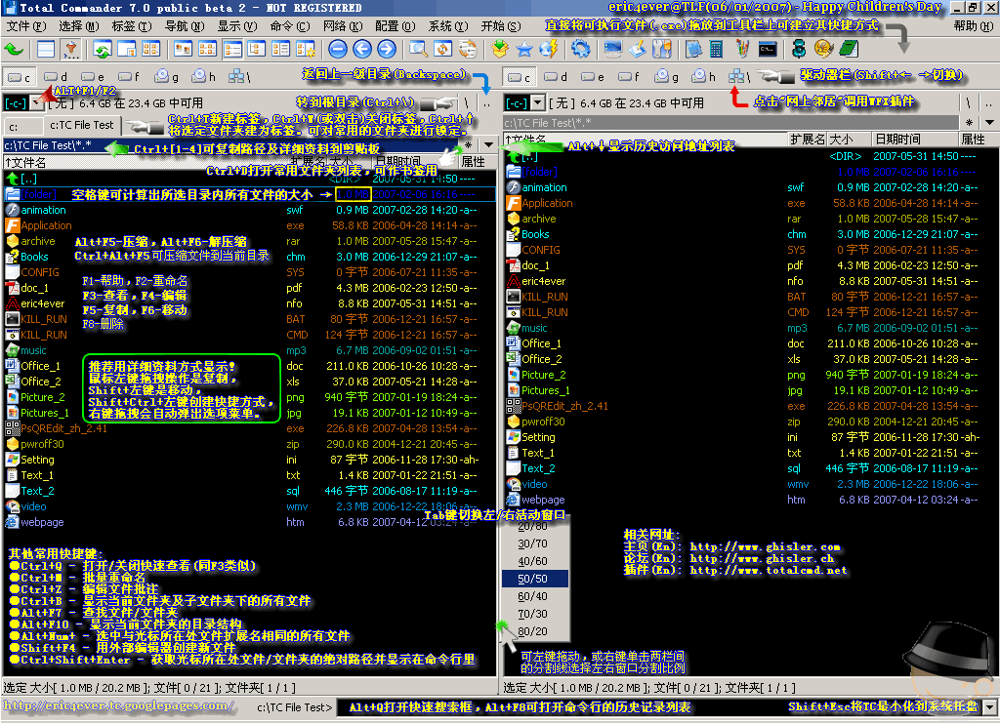

    效率优先, 一直我心目中对工作的看法. 所以工具的使用一直在我心目有摆在及其重要的位置. 记得刚工作时, 就有一位学长推荐Total Commander给我, 但我因为嫌弃它界面不佳且不能全快捷键操作, 而放弃了学习. 后来直到将其作为文件管理器的替代者, 才开始慢慢接受了它.  工作也渐渐不开它.

1.  多标签/多窗口: 方便进行快速的文件复制剪切等操作
2.  定位: 直接输入字母即可定位文件位置
3.  Alt + F7: 搜索文件, 文件内容
4.  Ctrl + D: 快捷方式打开设定路径
5.  F3/F4: 查看, 编辑. 可以定义自己喜欢的编辑器, 我选择Notepad++.

下图是高手制作的图片, 集成了大部分的功能

另可参考: [http://yuedu.baidu.com/ebook/1ec4abf0f46527d3240ce0ab?pn=1](http://yuedu.baidu.com/ebook/1ec4abf0f46527d3240ce0ab?pn=1)