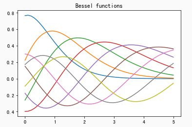

最近准备尝试AI比赛, 决定试试天池的新手赛入门. 如下简单记录环境搭建.

目录环境
===
```
# 查看数据文件目录ID
!ls datalab/

# 查看个人永久空间文件ID
!ls /home/myspace/
```

解压数据
===
通过如上命令, 可以查到数据的目录ID(例如: 231712)和个人空间ID(例如: 1095279216960). 里面的数据Zip可以通过加载比赛数据或者自行上传获得.

```
# 解压数据
!unzip -n datalab/231712/Metro_train.zip -d /home/myspace/1095279216960/
```

数据显示
===
利用matplotlib等进行图像显示


```
# 绘图案例
%matplotlib inline

import numpy as np
import matplotlib.pyplot as plt
from scipy.special import jn
from IPython.display import display, clear_output
import time
x = np.linspace(0,5)
f, ax = plt.subplots()
ax.set_title("Bessel functions")

for n in range(1,10):
    time.sleep(1)
    ax.plot(x, jn(x,n))
    clear_output(wait=True)
    display(f)

# close the figure at the end, so we don't get a duplicate
# of the last plot
plt.close()
```

