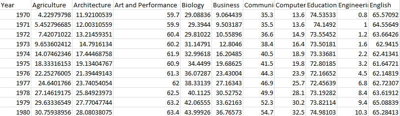
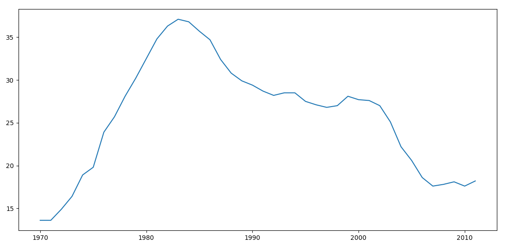
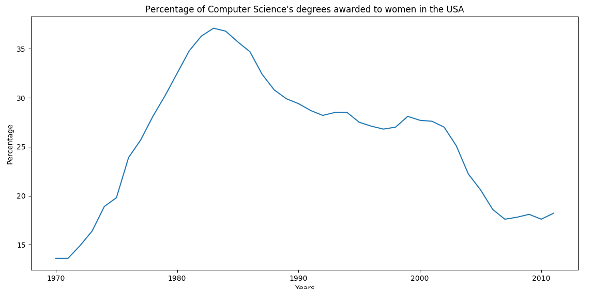
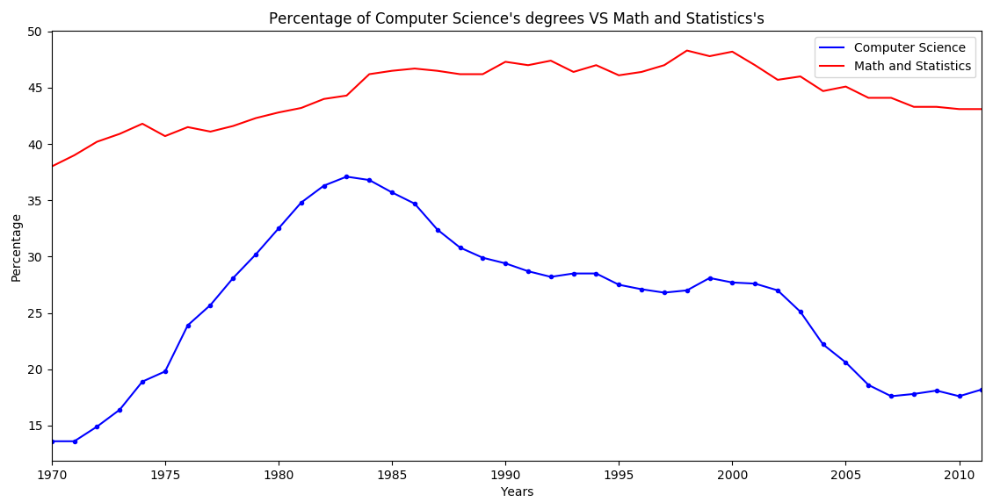
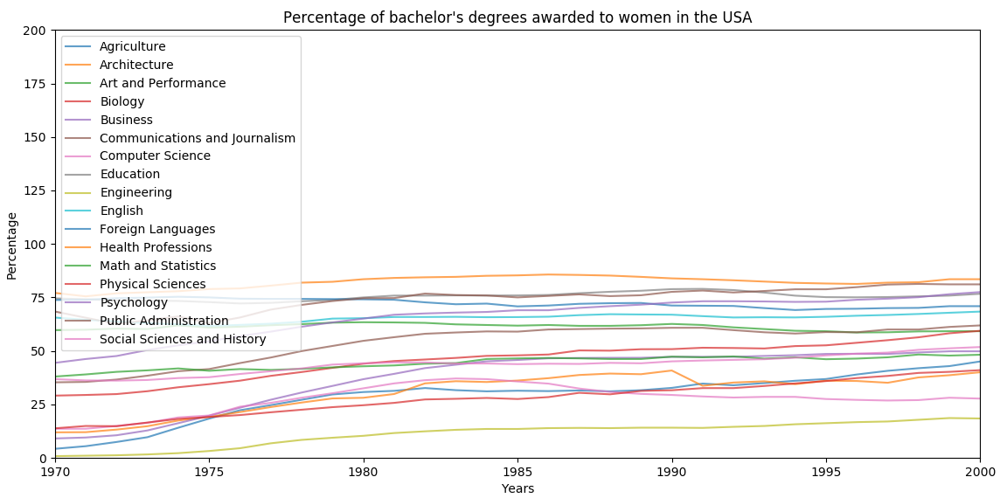
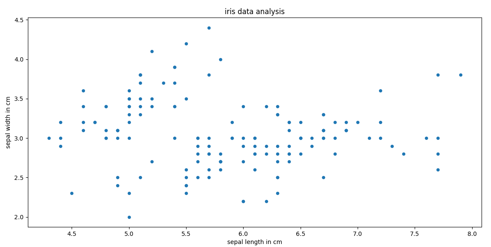
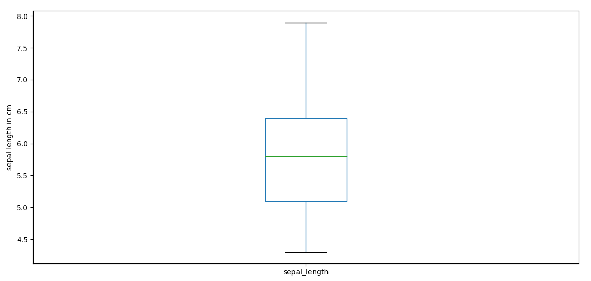
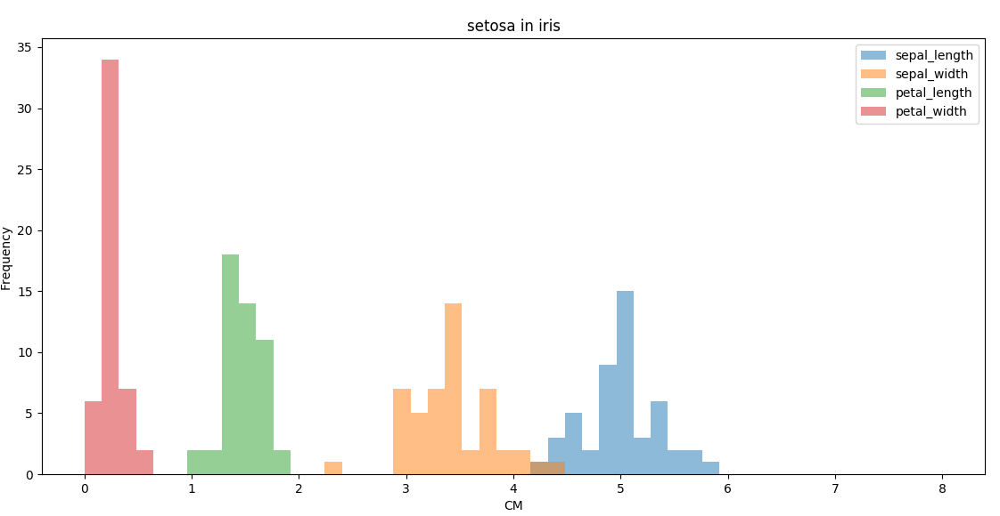

Matplotlib库是python的一个2D图形库，可以生成多种高质量的图形，通过各种不同类型的图形体现数据的价值。

## 绘制折线图

折线图一般用于反映数据在一段时间内的变化情况。我们先导入一份数据([Percentage of bachelor's degrees awarded to women in the USA](https://assets.datacamp.com/production/course_1639/datasets/percent-bachelors-degrees-women-usa.csv))，这个数据集描述了从1970~2011年，美国女性在各个专业的学士学位获取比例的情况：



虽然数据比较全，但是仅仅从这个表格上去对比各个专业之间的差异还是有些困难的，这时我们就可以通过使用matplotlib画图表的方式展示这些数据之间的关系。

### 引入pandas库后先导入数据：

```
import pandas as pd import matplotlib.pyplot as plt

df = pd.read_csv('percent-bachelors-degrees-women-usa.csv', index_col='Year') 
```

| Year | Agriculture | Architecture | Art | Biology | Business  |  ... ...  | Sciences | 
| ---| ---| ---| --- | ---| --- |  ---  | --- | 
| 1970 | 4.229798 | 11.921005 | 59.7 | 29.088363 |  9.064439 |   ... ...  | 36.8  |
| 1971 | 5.452797 | 12.003106 | 59.9 | 29.394403 |  9.503187 |   ... ...  | 36.2  |
| 1972 | 7.420710 | 13.214594 | 60.4 |  29.810221| 10.558962 |   ... ... |  36.1  |
| 1973 | 9.653602 | 14.791613 | 60.2 | 31.147915 | 12.804602 |   ... ...  | 36.4  |
| 1974 | 14.074623| 17.444688 | 61.9 | 32.996183 | 16.204850 |   ... ...  |  37.3  |

可以看出，'Year'为索引列，这次数据统计一共包含了17个专业。

### 绘图

可以使用matplotlib.pyplot中的plt()方法进行绘图。我们先试着分析某一列的数据，看一下具体是如何展示的：

```
df_CS = df['Computer Science']
plt.plot(df_CS)
plt.show()
```




从图中我们看到，索引值作为X轴的刻度展示，Y轴则表示这一列的具体数值。从这个图中可以直观的看出这段时间学位的获取情况。

### 添加标题和标签

仅仅这样展示似乎有些单调，matplotlib还提供了一系列可供自定义的功能：

```
df_CS = df['Computer Science']
plt.plot(df_CS) # 为图表添加标题
plt.title("Percentage of Computer Science's degrees awarded to women in the USA") # 为X轴添加标签
plt.xlabel("Years") # 为Y轴添加标签
plt.ylabel("Percentage")
plt.show()
```



添加了标题和标签，就好看一些了。

### 绘制多个图形进行对比

如果我们想看Math and Statistics与Computer Science的差异，可以一并绘出并展示：

```
df_CS = df['Computer Science']
df_MS = df['Math and Statistics'] # 可以通过DataFrame的plot()方法直接绘制 # color指定线条的颜色 # style指定线条的样式 # legend指定是否使用标识区分
df_CS.plot(color='b', style='.-', legend=True)
df_MS.plot(color='r', style='-', legend=True)
plt.title("Percentage of Computer Science's degrees VS Math and Statistics's")
plt.xlabel("Years")
plt.ylabel("Percentage")
plt.show()
```



可以看出Math and Statistics明显高于Computer Science。

最后，我们绘制所有数据的曲线：

```
# alpha指定透明度(0~1)
df.plot(alpha=0.7)
plt.title("Percentage of bachelor's degrees awarded to women in the USA")
plt.xlabel("Years")
plt.ylabel("Percentage") # axis指定X轴Y轴的取值范围
plt.axis((1970, 2000, 0, 200))
plt.show()
```




### 保存图像

使用plt.savefig()保存图像，支持PNG， JPG，PDF等格式。

```
plt.savefig('percent-bachelors.png')
plt.savefig('percent-bachelors.jpg')
plt.savefig('percent-bachelors.pdf')
```

## 其他类型的图像

除了折线图，matplob还支持绘制散点图等其他类型，只需要在调用plot()画图之前指定kind参数即可。

### 散点图

散点图可以体现数据在一定范围内的分布情况。上述数据集不适合画散点图，所以我们重新导入一份著名的[鸢尾花数据](http://archive.ics.uci.edu/ml/machine-learning-databases/iris/)(在数据分析和机器学习中经常被用到)。

我们在导入数据后，分析sepal(萼片)的长度和宽度数据：

```
iris = pd.read_csv("iris.csv") # 源数据中没有给column，所以需要手动指定一下
iris.columns = ['sepal_length', 'sepal_width', 'petal_length', 'petal_width', 'species'] # kind表示图形的类型 # x, y 分别指定X, Y 轴所指定的数据
iris.plot(kind='scatter', x='sepal_length', y='sepal_width')
plt.xlabel("sepal length in cm")
plt.ylabel("sepal width in cm")
plt.title("iris data analysis")
plt.show()
```




从散点图可以看出，数据主要集中在中间靠下的这部分区域(如果使用折线图，就是这些点连起来的折线，将变得杂乱无章)。

### box箱图

box箱图也可以体现数据的分布情况，与散点图不同的是，它还统计了最大/最小值、中位数的值，一目了然：

```
iris.plot(kind='box', y='sepal_length')
plt.ylabel("sepal length in cm")
plt.show()
```



### Histogram柱状图

柱状图体现了数据的分布情况及出现的频率，将数据展示得更加直观。下面我们从数据集中取出类别为"Iris-setosa"的子集，并使用柱状图统计它的四类数据：

```
# 使用mask取出子集
mask = (iris.species == 'Iris-setosa')
setosa = iris[mask] # bins指定柱状图的个数 # range指定X轴的取值范围
setosa.plot(kind='hist', bins=50, range=(0, 8), alpha=0.5)
plt.title("setosa in iris")
plt.xlabel("CM")
plt.show()
```



转自: [https://www.cnblogs.com/dev-liu/p/pandas_plt_basic.html](https://www.cnblogs.com/dev-liu/p/pandas_plt_basic.html)