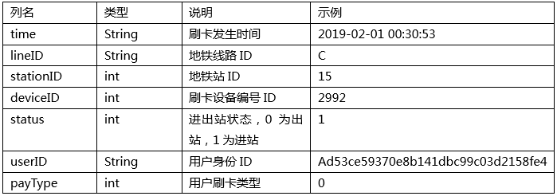
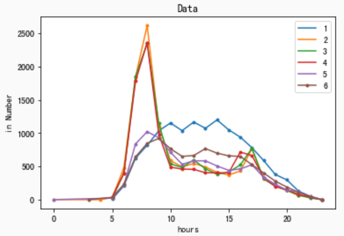

新人赛, 没有奖金, 尝试看看自己短期可以达到什么成绩.  也从如下三个方向历练学习:
1. 了解一下整个天池的流程.
2. 学习numpy, pandas, matplotlib的使用
3. 学习一些基本的机器学习算法

## 比赛题目
大赛以“地铁乘客流量预测”为赛题，参赛者可通过分析地铁站的历史刷卡数据，预测站点未来的客流量变化

## 比赛数据
提供的基本数据如下, 先做一个基本假设来初步分析一下数据, 假设: 一个班次的每天的各个时段的人流量基本一致.


## 分析代码
```
import numpy as np

import pandas as pd
from tqdm import tqdm

train = pd.DataFrame()

for day in tqdm(range(1,7)):
    train_tmp = pd.read_csv('./Metro_train/record_2019-01-%02d.csv' % day)
    train = pd.concat([train, train_tmp],axis=0,ignore_index=True)

train['days']    = pd.to_datetime(train['time'],format='%Y-%m-%d %H:%M:%S').dt.day
train['hours']   = pd.to_datetime(train['time'],format='%Y-%m-%d %H:%M:%S').dt.hour
train['minutes'] = pd.to_datetime(train['time'],format='%Y-%m-%d %H:%M:%S').dt.minute
train['wkday']   = pd.to_datetime(train['time'],format='%Y-%m-%d %H:%M:%S').dt.weekday 

# 十分钟一组
train['minutes'] = train['minutes'].apply(lambda x: int(x/10)*10)

train_result = train.groupby(['stationID','days','hours'])['status'].sum().to_frame('inNums').reset_index()
train_result['outNums'] = train.groupby(['stationID','days','hours'])['status'].count().values
train_result['outNums'] = train_result['outNums'] - train_result['inNums']

# 显示数据
import matplotlib.pyplot as plt

plt.figure()
plt.title("Data")
plt.xlabel("Hour")
plt.ylabel("in Number")

stationID = 0
for i in range(1,7):
    s = train_result[train_result.stationID == stationID]
    s = s[s.days == i]
    s = s.set_index('hours')
    s[str(i)] = s['inNums']
    if s.size > 0:
        s[str(i)].plot(style='.-', legend=True)
```

## 图像结果
通常利用matplotlib的图像进行分析数据, 基本可以看出有一定规律, 进一步思考, 可能还和星期几有关系, 写代码进一步分析.

