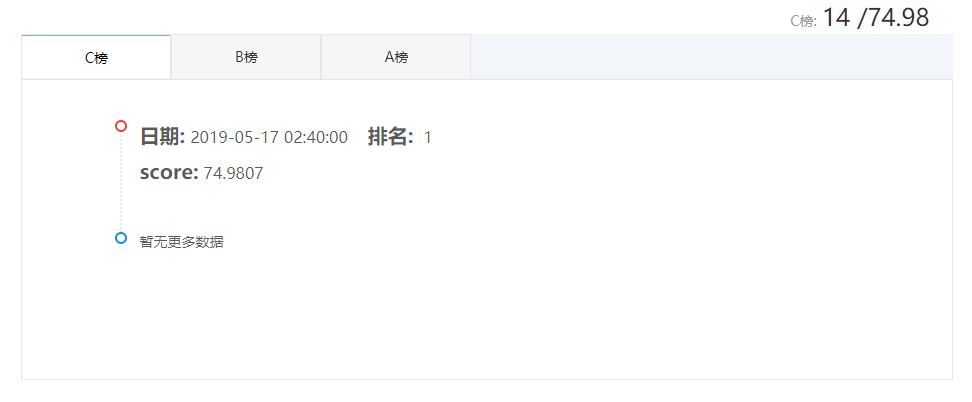

一直以为要提交代码, 原来只需要提交答案就好. 居然我拿了个第一(新人赛几个人玩), 有图为证.

## 主要代码
```python
# 部分数据准备的代码在前篇以介绍

from sklearn import svm

def get_clf(data, target):
    in_clf = svm.SVR(kernel='linear')
    in_clf.fit(data, target[..., 0])
    out_clf = svm.SVR(kernel='linear')
    out_clf.fit(data, target[..., 1])
    return in_clf, out_clf

def get_pred(clf, data):
    pred = clf.predict(data)
    pred = pred.astype(np.int64)
    return pred

import numpy as np

def get_test_submit_data(filename):
    data = pd.read_csv(filename)
    data['days']    = pd.to_datetime(data['startTime'],format='%Y-%m-%d %H:%M:%S').dt.day
    data['hours']   = pd.to_datetime(data['startTime'],format='%Y-%m-%d %H:%M:%S').dt.hour
    data['minutes'] = pd.to_datetime(data['startTime'],format='%Y-%m-%d %H:%M:%S').dt.minute
    data['wkday']   = pd.to_datetime(data['startTime'],format='%Y-%m-%d %H:%M:%S').dt.weekday 
    return data

submit_data_A = get_test_submit_data('myspace/Metro_testA/testA_submit_2019-01-29.csv')
submit_data_B = get_test_submit_data('myspace/Metro_testB/testB_submit_2019-01-27.csv')
submit_data_C = get_test_submit_data('myspace/Metro_testC/testC_submit_2019-01-31.csv')

in_clf, out_clf = get_clf(test_data, test_target)

def save_sumbit_file(in_clf, out_clf,  submit_data, filename):
    data = submit_data.loc[:,['stationID', 'wkday', 'hours', 'minutes']]
    data = data.values
    in_submit = get_pred(in_clf, data)
    out_submit = get_pred(out_clf, data)
    ans_data = submit_data.loc[:,['stationID', 'startTime', 'endTime']]
    ans_data['inNums'] = in_submit
    ans_data['outNums'] = out_submit
    ans_data.to_csv(filename, index=False)
    
save_sumbit_file(in_clf, out_clf, submit_data_A, 'myspace/A.csv')

```

## 结果成绩


