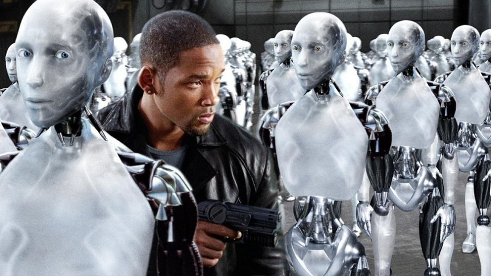
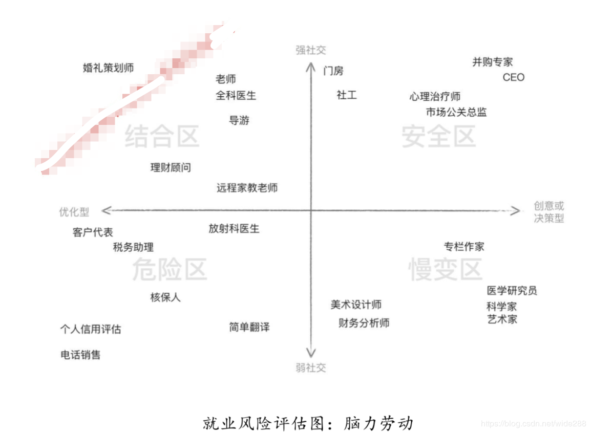
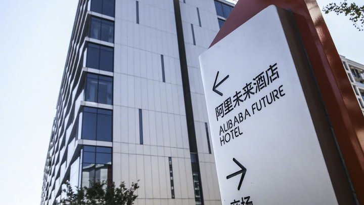
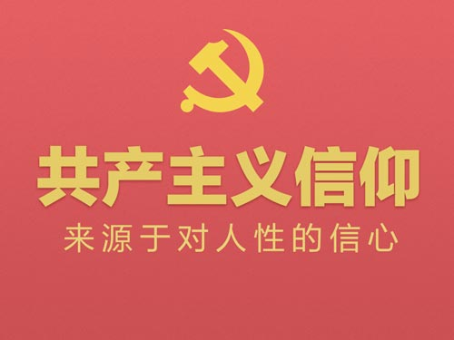
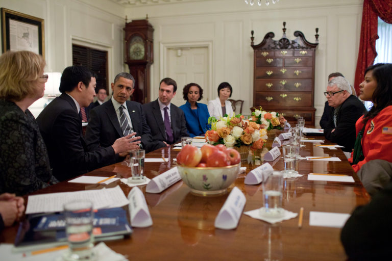

读完李开复老师的AI未来, 参加了公司的小组读书会, 写了这篇文章准备报告了.

## 我, 机器人
一看到AI, 就想到20年前看过的第一部科幻小说, 创作于1950年, 在2004年被搬上屏幕, 讲述的是机器人企图控制人类的故事.

## 机器人三定律
但明明有机器人三定律的控制, 为什么还是依然会发生这样的事情呢?
我们首先来看一下这三定律
- 第一定律: 机器人不得伤害人类，或袖手旁观坐视人类受到伤害；
- 第二定律: 除非违背第一法则，机器人必须服从人类的命令；
- 第三定律: 在不违背第一及第二法则下，机器人必须保护自己。

简单点讲, 就是保护人类. 但当AI计算出人类如按照现在的生活方式将在一万年后走向灭亡的时候, AI应该要作何抉择呢.
按现在的状况, 这样的强AI技术离我们还有相当的距离. 我们还是先来看看近期可能发生的事情.

## 失业
除了AI统治人类, AI对我们来讲, 最大的冲击就是失业了. 做为一个标准的脑力工作者, 还是先来审视一下\<AI未来\>中关于脑力劳动的就业风险评估图.

首先迎来的风险就是危险区, 然后随着技术的发展, 逐渐往比变慢区, 结合区发展, 最后来到我们的安全区.
可以想象, 一家公司, 只有CEO, 其他都是机器人.

## 菲住布渴
就在技术还不成熟的现在, 马云又要颠覆酒店业, 开了一家"菲住布渴"酒店
- 抵店前就可check in，酒店无前台
- 刷电梯、房间通通靠脸
- 去餐厅刷脸、机器人上菜
- 健身房刷脸、沉浸式体验及私教
- 酷炫大堂吧、机器人调酒师
- 贴心客房小管家，你只需发布指令
- 机器人送物品或餐

## 共产主义
全都是机器人, 我们的工作的被替代, 听到这个, 我的第一直觉竟然"共产主义". 共产主义在这个指数发展的时代, 在AI的影响下, 有可能在我们这代完成.
**共产主义的几个特征**:
- 生产力高度发展，物质财富极大丰富
- 劳动不是谋生的手段，而是人们生活的第一需要
- 社会成员共同占有生产资料，实行各尽所能，按需分配的原则
- 消灭了阶级差别、城乡之间、工农之间、脑力劳动和体力劳动的差别
- 作为阶级统治工具的国家完全消亡。那时，管理公共事务的机构虽然存在，但它已经失去了其阶级性质
- 全体社会成员具有高度的共产主义觉悟
- 人的全面而自由发展

## 共产主义实现了
共产主义实现了, 那为什么还需要工作呢?
共产主义实现了, 那我就已经完成了梦寐以求的财务自由.

## 换个角度看待失业
工作的取代并不可怕, 其实我们经常都在思考如何利用自动化来减少人力, 不就是在做替代别人的工作吗? 说得好听点, 也是在提高工作效率. 我们把AI换个角度来看, 这不也是在大幅度提高人类效率, 加速完成"共产主义"的理想吗? 那为什么还是一直在强调AI威胁呢? 原因在于AI让一切都来得太快了, 我们普通人根本无法做出适应.

## UBI & SIS
既然普通人无法适应, 书中也提到了2套可执行的方案进行操作, 我们把这个时期定义为一个"共产主义"的过度阶段.
UBI: Universal Basic Income
- 全民基本收入, 让每个人都可以生存下去, 自己去寻找活着的意义
SOS: Social Investment Stipend
- 社会贡献薪资, 让每个人用同理心, 用爱去关怀世界

Andrew Yang（杨安泽）这个人，他是以民主党身份参加2020美国总统竞选的一位华裔。
他的“每人每月一千美元公民基本收入”的建议, 可能让他当选下一届美国总统

参考: [http://global.sina.cn/szzx/article/20190225/04704c6f55851000.html](http://global.sina.cn/szzx/article/20190225/04704c6f55851000.html)

## 我们还有很多事情可以去做
- 车的发明, 没有让人类取消跑步.
- 深蓝的发明, 没有让人类取消国际象棋击败人类.
- 一个主播都可以通过软件, 轻易击败中国象棋的王天一.

## 总结
共产主义在AI的促进下即将到来, 让大家一起努力吧.
