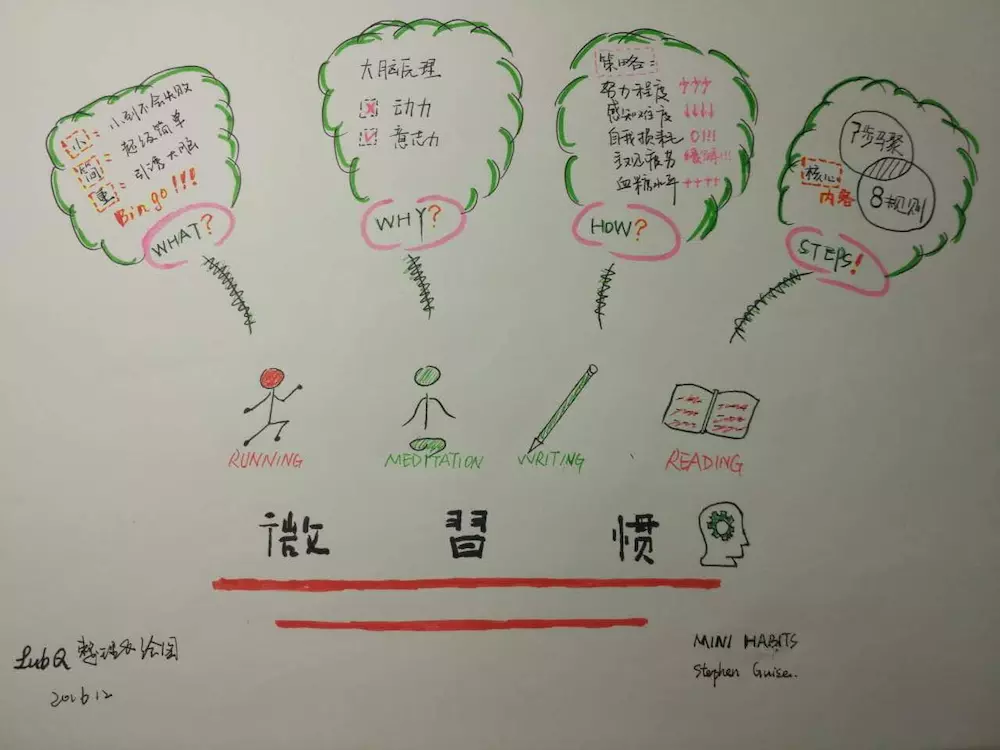

好习惯影响人的一生, 但如何获得好习惯, 需要很强意志力. 最近在看一本关于\<微习惯\>的书, 感觉很有启发. 

## 什么是微习惯
**微习惯**是一种非常微小的积极行为, 它实在是太微小了, 小到不可能失败. 它不会给你造成任何负担: 思想上, 零负担; 体力上, 零负担; 脑力上，更是零负担, 因为它对大脑有超强的欺骗性。微习惯太小，小到你可以用一天当中的任何时间，甚至拖延到睡觉之前再爬起来去做。

## 我们行动起来
我们现在一起设定几个微习惯, 开始行动吧. 例如:

- 每天做1个俯卧撑
- 每天读1页书
- 每天记录1个知识点

## 微习惯的步骤

- 第1步: **选择适合你的微习惯和计划**. 
把你的习惯和计划分解到再简单不过的程度，比如每天1个俯卧撑.
同时追求的微习惯数量不要超过4个, 2~3个微习惯最合适.
- 第2步: **挖微习惯的内在价值**. 
最好的习惯直接源于你的生活观念. 尊崇你的内心, 而不是尊崇社会上的普遍认知.
- 第3步: **明确习惯依据, 将其纳入日程**. 
- 第4步: **建立汇报机制, 以奖励提升成就感**.
- 第5步：**记录与追踪完成情况**.
- 第6步：**微量开始, 超额完成**.
- 第7步：**服从计划安排, 摆脱高期待值**.
- 第8步：**留意习惯养成的标志**.

## 最后
附上他人的读书笔记
[https://www.jianshu.com/p/ebe3746f9228](https://www.jianshu.com/p/ebe3746f9228)
