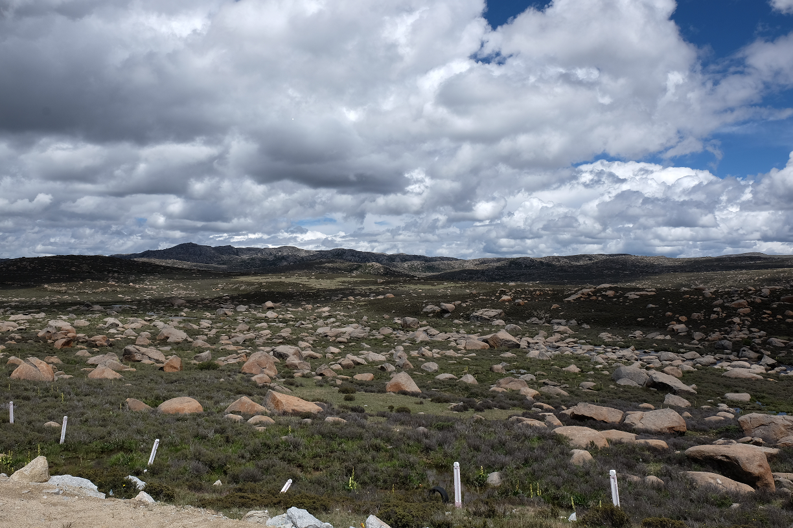

7月的一次自驾稻城色达游, 稻城亚丁的景色略微让人失望, 或许不是最佳季节的缘故.

## 准备
1. 现金 (稻城亚丁的门票只能现金)
2. 红景天, 葡萄糖, 氧气瓶 (主要给老人用了, 年轻人反应不明显)
3. 雨伞 (天气反复无常, 特别天葬的时候带上, 晒死人了) 

## DAY1 (成都 -\> 雅江)
一路没有太多景色, 只路过泸定桥, 人太多, 没有进去, 只是远远的看了一下.

## DAY2 (雅江 -\> 稻城亚丁)
后半程的景色更美, 特别是海子山. 
晚上住入香格里拉镇.
### 海子山

## DAY3 (稻城亚丁)
从香格里拉镇到亚丁只有几公里了, 旅店老板送我们到了稻城亚丁门口. 

## DAY4 (稻城亚丁 -\> 理塘)
住藏族朋友家, 朋友非常热情, 一直让我们当成自己家. 
这天晚上看了康巴人博物馆

## DAY5 (理塘 -\> 新都桥)
早上逛了寺庙, 本打算去看看藏戏的, 没有找到就只能离开理塘了.
新都桥的旅店不少, 不过性价比不高. 入住的旅店附近, 有一个观景台(10元/人), 可以去看看日落, 风景不错.

## DAY6 (新都桥 -\> 色达县)
入住一家青年旅社

## DAY7 (色达县)
早上起床, 先去了天葬台, 等到2点, 天葬才开始了, 漫天的乌鸦和秃鹫.
看完天葬, 驱车来到五明佛学院, 这里的旅店不能订, 一切随缘.
### 五明佛学院

## DYA8 (色达县 -\> 成都)
一路狂奔, 在老婆的协助下, 完成了最后12小时的驾车旅途.