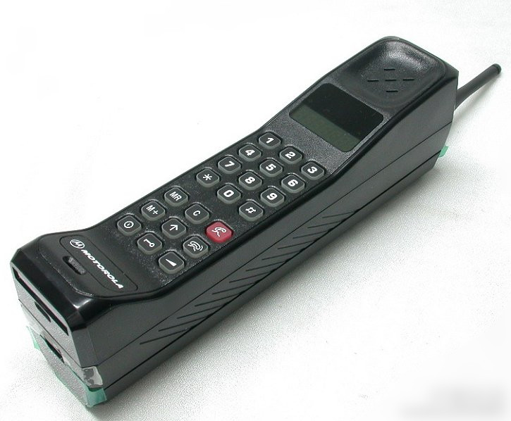

5G是最近非常热门的话题, 一直没有花时间去真正理解这个话题, 只知道它的网络速度更快了, 但我一直也没觉得4G慢, 那更快到底有什么用呢? 一直到最近听了吴军老师的\<信息论40讲\>, 才对5G有了一个初步的认识.

首先, G指的是Generation, 也就是“代”的意思. 接下来, 我们从1G开始讲起

## 1G
最早的通讯系统, 是由摩托罗拉为主制定的标准, 主要是模拟电路. 最具代表的就是当时巨大的大哥大.

## 2G
到80年代, 由诺基亚等公司开始新的标准研究, 后称为2G. 技术上, 从模拟转向数字. 有了基本的网络功能

## 3G
接下来, 3G最大的改变是讲网络速度提高了一个数量级, 2G到3G最重要的变化是把电话功能变次要功能, 移动互联网成为主流

## 4G
到了4G, 网速又提高了. 3G到4G最大的改变是把网络的速度提升到够用的水平. 从而视频, 直播网站更加的繁荣.
和3G相比, 技术上的主要变化: 
1. 扁平的网络结构, 减少了端到端通讯次数
2. 增加了基站之间光纤的带宽

## 5G
网速都够用了, 还有5G做什么, 这是我的第一感觉. 
在技术上, 最大的变化是把基站距离从1公里降低为200~300米. 第一次听到的时候, 完全颠覆了我对5G的想象.
手机和基站的距离缩短, 主要由3个好处:
1. 建筑物干扰的问题得到解决. 信号差的问题得到解决(我在家里, 4G信号就不太好)
2. 更少的人分享带宽(一个基站覆盖的人群变少了)
3. 手机和基站的功率降低了(大约可降低2个数量级)