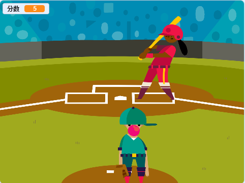
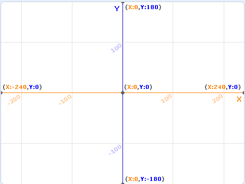

儿子10岁了, 决定让他编程入门. 本希望选择用Python, 教了几次, 果断决定放弃. 最后选择了Scratch. 或者之前学习的Kudo也不错.

## 第一个Scratch作品
自己先尝试了一下, 我的第一个作品, 打棒球.

## 积木

### 运动
通过笛卡尔坐标, 控制对象的位置. 坐标体系对于10岁的孩子来讲, 比较难理解. 还好软件有一个坐标背景可以利用来讲解.

### 外观
控制对象的造型, 大小等

### 声音
播放声音

### 事件
控制流程的核心部件, 其中广播的概念需要非常仔细给孩子做解释

### 控制
循环, if判断

### 侦测
鼠标控制

### 运算
数学运算, 小学生可以理解的

### 变量
核心概念之一