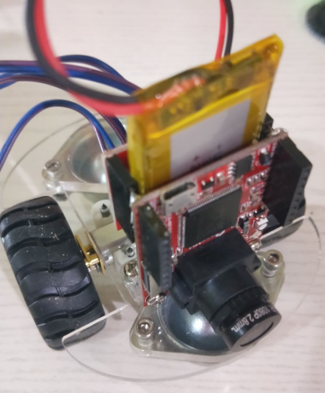

最近看到大疆的ROBOMASTER, 突然有想起了好久前购买的OpenMV板. 想尝试一下做一个FPV小车. 先做一些测试, 为FPV小车做准备.

## 测试小车
买了些材料,组装起来测试基本功能 

## 主要硬件
### OpenMV
编程控制器, 视频摄像头

### 电机控制板
协助OpenMV控制电机. 为什么不用OpenMV直接控制电机呢? GPIO的输出电流不够, 不能直接控制电机. 几乎所有的控制器设计均如此.

### 减速电机
减速电机都带齿轮减速, 可方便控制轮胎. 
#### 好处
1. 增加动力, 利于爬坡; 
2. 降低速度, 方便控制速度.

## 主要软件
### PID 算法
很早以前做的一个乐高独轮站立方案, 也用了PID算法, 感觉有点用负反馈的算法. 后面专门再学习此部分, 看起来是机械部分必备知识 

### 单一颜色识别位置算法
OpenMV自带的, 有空再研究一下细节算法
#### 基本原理
1. 通过定义分别定义R, G, B的最大/最小的范围, 得到黑白图(范围内为白色)
2. 然后在黑白图中找到最大的一块白色区域