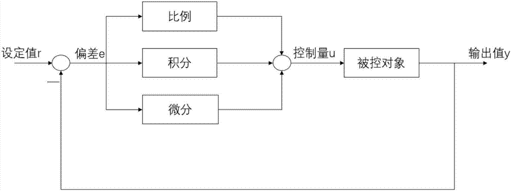

## PID
PID控制应该算是应用非常广泛的控制算法了。很多平衡相关的设计都可以看到PID算法, 比如平衡小车, 无人机等.

PID是分别是比例(P)、积分(I)、微分(D)的缩写, 控制算法并不表示P, I, D必须同时存在, 可能只包括其一.

## 流程图

## 原理
基本原理很简单, 可以简单用如下3个步骤的循环来说明
1. e = y - r
计算设定值与输出的**偏差**
2. u = iP(e) +jI(e) + kD(e) 
计算控制量, 通过**控制量**去调整**被控对象**的输出. 基本逻辑, **偏差**越大, **控制量**越大 
3. y = f(u) + 其他影响
**输出值**不仅仅会受到控制量的影响, 也会受到其他随机的影响(比如无人机受到风的影响)

通过1,2,3步的循环, 从而达到一个动态平衡.