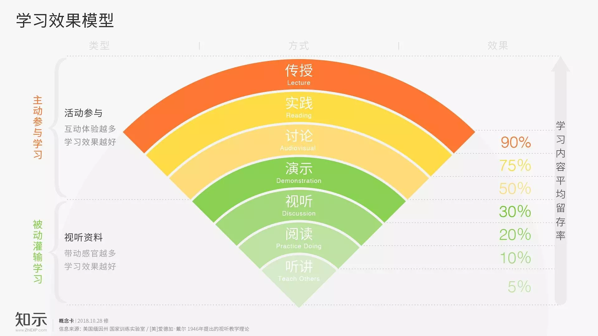

如下建议, 适用于各类工具书.

## 阅读建议
1. **建议各位不要对本书浅尝辄止, 大略读过便束之高阁**
学以致用, 一直我认为学习的重要原则.

1. **建议各位改以老师的角色来阅读, 除了吸收还要能复述**
学习最好的方式就是教. 

## 学习效果图
学习效果模型图清晰的展示了各种学习方法的作用

1. 阅读
泛泛阅读, 深度阅读, 都只是最浅层的学习.
1. 讨论
目前很多的培训都引入了讨论环节, 充分的讨论, 参与其中效果更好.
1. 实践
阅读了\<刻意练习\>, 
1. 传授
把学习到的知识传授给他人. 非常认同\<得到\>罗振宇,\<樊登读书会\>樊登的理念, 我也希望影响更多的人(自己, 孩子, 部署, 老板, 更多更多)
