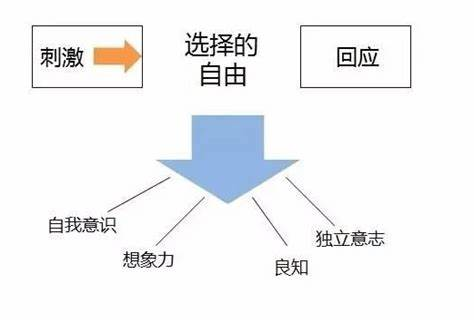

积极主动是七个习惯的第一个习惯, 也是我认为本书\<高效能人士的七个习惯\>里最重要的习惯.

## 什么是积极主动
积极主动不仅指行事的态度, 还意味着人一定要对自己的人生负责. 个人行为取决于自身的抉择, 而不是外在的环境.

## 刺激和回应之间选择的自由

### 消极被动模式
经过长期的进化, 我们形成了一套非常省力的自动系统. 有时候, 它让我们的选择不需要**意识**的参与, 我们甚至认为我的回应来源于刺激. 这里并不是讲自动系统的选择是消极被动的, 而是强调被外界条件控制的认知, 是一种消极被动模式. 比如他惹我了, 我生气了. 生气是因为他惹我了. 这是典型的消极被动模式, 把原因归于外界刺激. 

### 积极主动模式
刺激和回应之间有很大的空间(自我意识, 想象力, ...), 我们是可以自由选择的. 比如他惹我了, 我生气了. 生气是我的选择. 你要认识到是我自己选择生气的. 我生气是因为我自身权衡的结果(选择1. 我揍他一顿, 让他吃点苦头; 选择2. 我生气, 让他知道我不高兴; 选择3, 我去告诉他主管, 让他吃不了兜着走;)

### 把时间集中在影响圈
除了需要知道积极主动模式, 你还需要知道**影响圈**的概念.

- 影响圈: 指我们可以改变和控制的事情.
- 关注圈: 关注圈和影响圈的定义恰恰相反，就是指那些超出自己控制范围、不能改变的一些事.

这里还是要举一个例子, 比如要解决三街堵车的问题. 我时常开车路过, 我对三街的路况是有影响力的, 但他并不在我的影响圈中, 三街是否堵车完全在我的控制范围以外. 我能做的, 就是去间接影响它, 把自己做好, 以身作则的遵守交通规则.

一个人是否积极主动, 影响圈是一个关键指标. 就是看他把时间花在哪些事情上? 积极主动的人会专注于影响圈, 做他们力所能及的事情.

