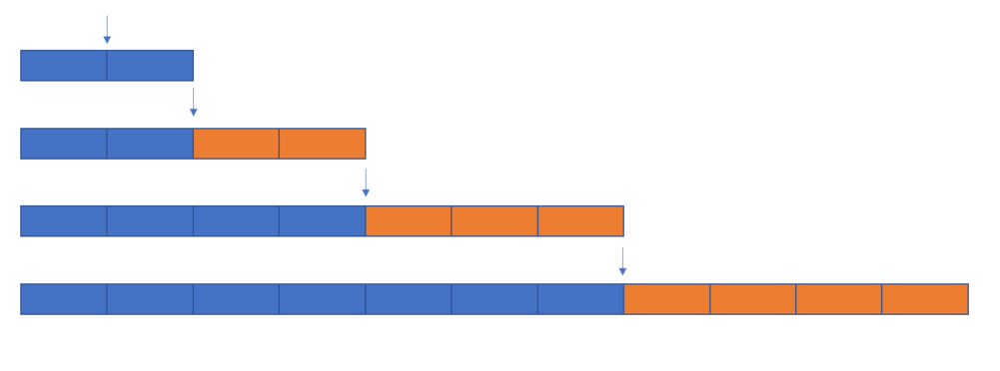

## 题目
给你两个一模一样的玻璃球. 这两个球如果从一定高度掉到地上就会摔碎, 当然, 如果在这个高度以下往下扔, 怎么都不会碎, 超过这个高度肯定就一次摔碎.
现在已知这个恰巧摔碎的高度范围在1楼到100层之间, 如何用最少的试验次数, 用这两个玻璃球测试出玻璃球恰好摔碎的楼高

## 一般策略
### 逐一法
第1颗球: 从1楼开始, 逐一往上加, 直到摔碎为止, 则找到位置

### 二分法
第1颗球, 从50楼(1/2的位置)开始, 如果未碎, 接着75楼, 如碎了
第2颗球, 从51楼开始, 逐一法到碎为止, 则找到位置.

### 粗选细选
第1颗球, 从10楼开始, 逐10往上加, 直到摔碎为止. 比如, 玻璃球在50楼碎了
第2颗球, 从41楼开始, 逐一法到碎为止, 则找到位置

## 分析
### 基本逻辑
1. 如果只有一个球, 用逐一法是唯一可解决问题的方案.
1. 如果有无限多的球, 用二分法是最优解(在没有任何额外提醒的情况下, 二分法一定是最优的)

### 双球的策略分析
从基本逻辑思考, 1颗球必须用于逐一法, 1颗球用于二分法. 有个困难点是在只有2颗球的情况下如何进行二分法.

可以通过如下方式

**左边**:二分/逐一混合算法,  是在第1颗球成功的情况下, 由于第1颗球还可以继续使用, 使用混合算法
**右边**: 逐一法, 第1颗一旦失败, 后面就只能用逐一法进行)
以左右两边的次数一致的原则, 进行二分法.

逐一递推

1. 2 : 2
1. 4 : 3
1. 7 : 4
1. 11 : 5
1. 16 : 6
1. 22 : 7
1. 29 : 8
1. 37 : 9
1. 46 : 10
1. 56 : 11
1. 65 : 12
1. 77 : 13
1. 90 : 14

## 最佳答案
第1颗从第15(14+1)楼开始,  运气最差的情况下, 试验14次, 可获得准确楼层.
