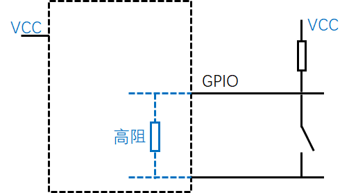
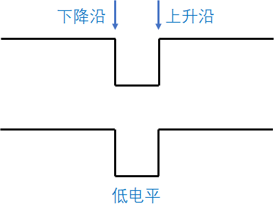
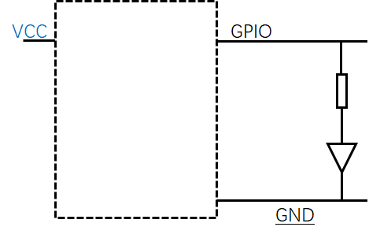
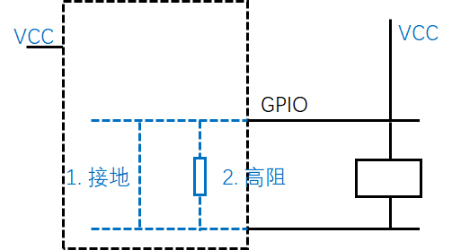

## 定义
General-Purpose Input / Output, 通用型之输入输出接口. 

## 三种模式
分别是输入, 输出, 高阻.
### 输入
芯片内部属于高阻的状态, 由外部电路拉高电平/低电平, 芯片可以随时读取电平状态. 
也可以设定中断(边缘触发, 高/低电平触发)

例如, 开关电路, 芯片可读取高低电平状态. 同时可看出, 芯片内部处于高阻状态.
另外, 通常也会设定中断模式.

如下按钮被按下一次的电平示意图, 设定中断有几种方式

1. 边沿触发(下级沿) 
按键被按下的一瞬间触发中断
1. 边沿触发(上升沿)
按键释放的一瞬间触发中断
1. 电平触发(低电平)
中断会持续触发直到按键松开(高电平), 为避免重复触发导致系统无法工作, 通常会在代码处理过程中, 先关闭中断, 然后处理完毕后再恢复.

### 输出
芯片内部直接输出高/低电平, 但由于芯片本身能提供的电流小或者需要电平转换(比如3.3V转5V)等原因, 需要如下的高阻模式

例如, 通过直接输出高低电平直接控制LED灯(LED可被小电流驱动)

### 高阻
1. 高电平(高阻态): 设定为输入状态(即高阻状态), 电平将被外围电路拉高.
1. 低电平(接地态): 设定为输出状态, 并设定为低电平

## 参考
###  树莓派
[https://sourceforge.net/p/raspberry-gpio-python/wiki/Examples/](https://sourceforge.net/p/raspberry-gpio-python/wiki/Examples/)