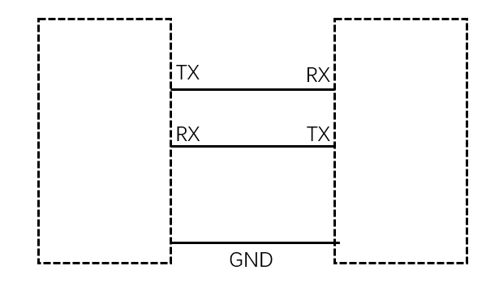
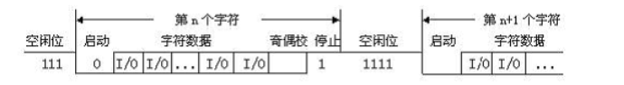

## 全称
通用异步收发传输器（Universal Asynchronous Receiver/Transmitter), 

## 硬件连接方式
有两根PIN, 分别是TX(输出), RX(输入). 两个设备通讯, TX与RX对接(视硬件设计状况, 有可能需要上拉电压)

## 协议

闲置的时候, 一直保持高电平. 

经过如下几个流程, 完成一次传输(1次最多传输1字节) 

1. 启动位(低电平)开始
1. 传输数据
1. 奇偶校验
1. 停止位

## 设定
首先说明一下, 由于UART没有任何机制去解决两边同步设定的问题, 所以, 两颗芯片必须预先知道对方的设定才可以正常的工作. 比如时钟设定(Clock). 

主要由如下几个设定

1.  时钟
通常为9600位/秒, 目前已知最高可以设定到115200x8
1. 数据位数
可以选择4,5,6,7,8位
1. 是否有奇偶校验位
是/否
1. 停止位长度
可以选择1位, 1.5位, 2位

## 软件控制
通常在硬件设计上, 有收到UART数据, 都会有中断发生, 告知处理器有数据, 并及时读取.
设计上通常有两种模式,

1. 模式1: 会有少量的硬件buffer, 收到数据会存储在buffer中, 等待读取.
1. 模式2: DMA模式, 需要设定Dram的位置和长度, 收到数据会存在进Dram中.