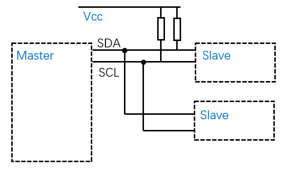
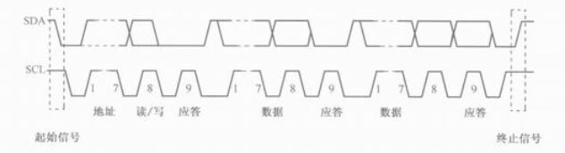

## 基本介绍
I2C总线是由Philips公司开发的一种简单、双向二线制同步串行总线。它只需要两根线即可在连接于总线上的器件之间传送信息。

## 硬件连接
一台主设备连接多台从设备, 通过两线连接起来. 一根传输数据(双向), 一根用于时钟(由主设备控制). SDA属于高阻态, 由上拉Vcc提供电压. 从硬件连接图可以看出, 只要有一个设备想拉低SDA, SDA即处于拉低状态. 

## 协议

### 闲置: 
SDA, SCL保持高电平
### 起始信号
当SCL高电平时，SDA由高电平向低电平转换.
### 地址位
主设备(master)由SCL输出时钟, SDA输出数据(即地址). 每个从设备(slave)均有一个设备地址(7位/10位). 

- **数据有效性**
SDA 线上的数据必须在时钟的高电平周期保持稳定，数据线的高或低电平状态只有在 SCL 线的时钟信号是低电平时才能改变。  换言之，SCL为高电平时表示有效数据，SDA为高电平表示“1”，低电平表示“0”；SCL为低电平时表示无效数据，此时SDA会进行电平切换，为下次数据表示做准备.

### 读/写位  
在这个时钟周期, 主设备向从设备说明是要写数据还是读数据. 这可以影响后面数据位时期, 谁读谁写.
SDA = 0: 表示主设备要写数据;
SDA = 1: 表示主设备读数据.

### 应答
在这个时钟周期, 主设备释放SDA的控制权(高阻状态), 此时由从设备控制SDA.
从设备会更根据上面的地址位是否匹配决定是否做出响应. 
SDA = 0, 表示响应; 
SDA=1, 表示无响应.

### 数据/应答
- 写数据
主设备控制SDA, 在时钟周期输出数据(需要也遵守前面提到的"数据有效性"原则).在应答阶段, 由从设备应答(上上, 应答). 如从设备有任何异常, 均可用"无响应"表示.
- 读数据
与写数据类似, 只是主/从设备颠倒.

### 停止信号
当 SCL 线是高电平时 SDA 线由低电平向高电平切换。

## 软件模拟I2C
即使控制器不支持I2C, 也可用两根GPIO很轻松的模拟主设备(master)的, 网络上有大堆现成的代码可供使用, 这里先不做说明.