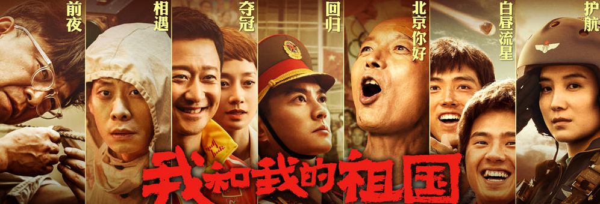

我和我的祖国，一刻也不能分割。
无论我走到哪里，都流出一首赞歌。
我歌唱每一座高山，我歌唱每一条河。
袅袅炊烟，小小村落, 路上一道辙. 

悠扬的歌声一直在我耳边响起. 没有任何时刻,比我现在更爱我的祖国. 

今天和朋友一起, 带了一群孩子去看了\<我和我的祖国\>这部电影.  希望带个孩子爱国的心, 孩子看了没什么感觉, 发现自己已经无法自拔, 感动不已.

从1949年毛主席在天安门城楼上宣布中华人民共和国成立, 到2016年神舟飞船成功着陆. 电影中的7个故事无不让我们为祖国感到自豪. 

1. 前夜 - 1949年10月1日, 中华人民共和国成立
1. 相遇 - 1964年10月16日, 中国第一颗原子弹爆炸成功
1. 夺冠 - 1984年8月8日, 中国女排奥运会夺冠, 首获世界大赛三连冠
1. 回归 - 1997月7月1日, 香港回归
1. 北京你好 - 2008年8月8日, 北京奥运会开幕式
1. 护航 - 2015年9月3日, 纪念抗战胜利70周年阅兵式
1. 白昼流行 - 2016年11月18日, 神舟十一号飞船返回舱成功着陆