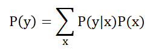

## 学派
频率学派（古典学派）和贝叶斯学派是数理统计领域的两大流派。

这两大流派对世界的认知有本质的不同：

- 频率学派认为世界是确定的，有一个本体，这个本体的真值是不变的，我们的目标就是要找到这个真值或真值所在的范围；
- 贝叶斯学派认为世界是不确定的，人们对世界先有一个预判，而后通过观测数据对这个预判做调整，我们的目标是要找到这个世界的概率分布的最优表达。

## 贝叶斯公式

贝叶斯公式: 

**P**(y)可以通过公式进行计算.

其中,
 - **P**(x): 表示事件x的发生概率.
 - **P**(x|y): 表示在已知事件y的情况下, 事件x的发生概率.