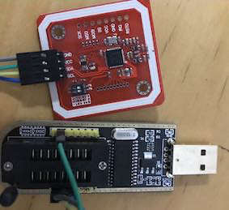
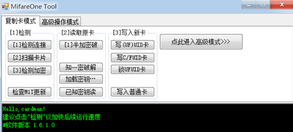

## 0.前言

由于租的小区房，只有一张门禁卡，女票每次过来进出小区很不方便，于是萌生了复制门禁卡的想法，国庆期间实践成功

## 1.硬件准备

- NFC读写器：我选用的是PN532，就一个IC控制的PCB板，它通过串口与PC连接

- UID白卡：同PN532一样，某宝搜索UID卡即可搜索到

## 2.软件准备

所有有关nfc的软件（Ubuntu/Win等）都是从GitHub上拉取的[libnfc](https://github.com/nfc-tools/libnfc)编译生成的，如果你时间很多，可以去github上拉取源码编译，然后通过命令行进行NFC的读写（需要熟悉libnfc的命令行），如果没时间就使用别人编译好的上位机（一些大神们总是为小白制作了各式各样的方便好用的tool），例如我使用的是

## 3.知识储备

NFC卡复制需要了解NFC卡的数据结构

通常NFC卡，一共有16个扇区，每个扇区4个块，每个块16个字节，因此一张NFC卡的容量为`16*4*16=1024`字节，通常每个扇区的第4块，用于存放密码A和密码B，即图中的KEY A和KEY B，密码A和密码B需要通过上位机进行破解，通常情况下，暴力破解都可破解，但是一般的卡其密码都是默认密码，我住的小区亦是如此，因此很容易就破解了

## 4.操作

点击上位机的密钥破解即可自动破解，一旦破解便会保存一个`.mfd`文件，直接利用上位机将该文件写入空白uid卡即可，这里需要注意的是：

\> 当向空白uid卡写入`.mdf`文件时，一共64个块，只会写进去63个块，还剩一个块不会写入，这个块就是保存有uid（世界唯一ID）数据和厂商数据的数据块，它位于0扇区的第0块，因此还需要手动写入uid数据（厂商数据貌似写不了，但我实测即使厂商数据不一致，门禁依然是可用的，说明一般情况下门禁不会对比厂商数据，它对比的是uid以及1~63扇区的数据）

## 5.参考

NFC的复制还可以结合到拥有NFC的手机上，更加便捷

- [Ubuntu NFC环境](https://www.jianshu.com/p/3f851d531609)
- [52破解](https://www.52pojie.cn/thread-883683-1-1.html)
