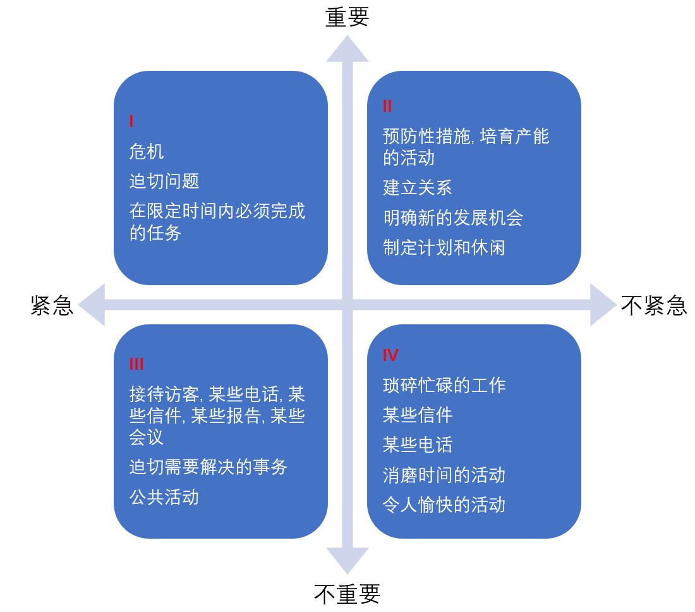

要事第一, 这不是句废话吗? 什么才是要事吗?

## 什么才是要事?
我们把事情按重要程度, 紧急程度分为四类, 及重要紧急, 重要不紧急, 不重要紧急, 不重要不紧急. 毫无疑问, 第一直觉的要事就是重要紧急的事务. 我们必须尽快去解决危机, 解决迫切问题. 
这个直觉其实是错误的, 真正的**要事**是第二类事务(重要不紧急). 第二类事务就是哪些防御性措施, 建立关系等事务 仔细想想, 你就会发现, 如你都做好防御措施, 是否可以有机会避免危机呢. 所以, 你真正需要关心的要事是那些重要但不紧急的事情.

## 勇于说"不"

如要专注于要事, 就需要排除次要事务的牵绊, 此时需要有说"不"的勇气. 应该不卑不亢地拒绝别人, 在紧急与重要之间, 知道取舍.

## 自我管理四步骤
书中描述了四个步骤, 核心是按周安排要事. 
- 确认角色
写出你自己的关键角色, 比如, 父母, 经理等等.
- 选择目标
思考下一周计划中每个角色中你最想做的一两件要事
- 安排进度
为每一项目标安排具体的实施时间.
- 每日调整
根据突发事件, 人际关系的意外发展及崭新机会, 对每天的要务安排进行适当调整.
