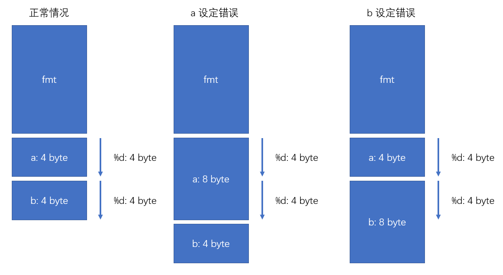

如下一句简单的打印函数, 发现打印b的结果很奇怪, 不符合预期, 那可能是什么原因呢?

```C
printk("A=%d, B=%d", a, b);
```

printk 属于变参函数, 那我们就从C语言的变参函数入手. 

## 变参函数范例

如下一个简单的任意多个加数的求和函数函数

```C
int sum(int num, ...) // 这里的num不是自动的, 需要调用者手动传入.
{  
    va_list argptr;  

    va_start(argptr, num); // 注释1
    for(i=1; i<num; i++) // 注释2
    {  
         arg = va_arg(argptr, int);  //注释3
         total += arg;  
    }
    va_end(argptr); //无实际意义, 只是从逻辑上表示后续不在使用argptr
    return(total);  
}
```

- 注释1:
函数参数存储于栈中, 通过最后一个参数num在栈中的偏移量, 是可以找到可变参数中的第1个参数的位置.
- 注释2:
可变参数的个数是需要手动传入的, 无法自动获得
- 注释3
获取参数的值需要特别指定参数类型, 有2个作用
  - 获取正确的值
  - 获取下一个参数的偏移量

## printk 变参实现
```C
printk("A=%d, B=%d", a, b);
```
- 通过第1个参数"A=%d, B=%d", printk函数可以计算函数参数的个数(2个%d, 表示2个参数)
- 通过%d的内容, 就可以知道参数的类型

这里你就可以注意到一个问题, 如果%d指定的类型不符合, 是否会导致错误呢? 答案是一定的, 不仅仅是影响本参数, 而且还会影响下一个的参数, 因为参数的偏移量会计算错误.

## 结论
错误的原因可能有二, 具体参考如下图
1. a的类型指定错误
2. b的类型指定错误



## 另注: printk可用的格式字符

```C
If variable is of Type,		use printk format specifier:
---------------------------------------------------------
		int			%d or %x
		unsigned int		%u or %x
		long			%ld or %lx
		unsigned long		%lu or %lx
		long long		%lld or %llx
		unsigned long long	%llu or %llx
		size_t			%zu or %zx
		ssize_t			%zd or %zx
		s32			%d or %x
		u32			%u or %x
		s64			%lld or %llx
		u64			%llu or %llx
```
